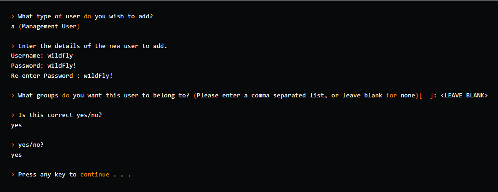
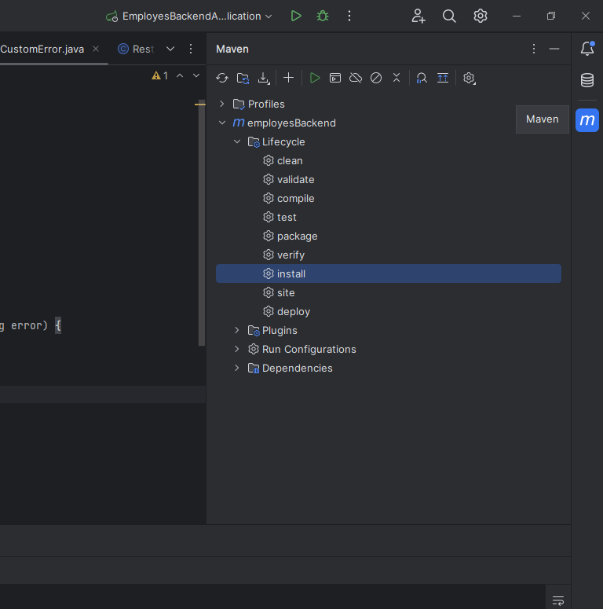
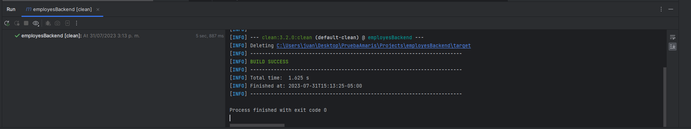
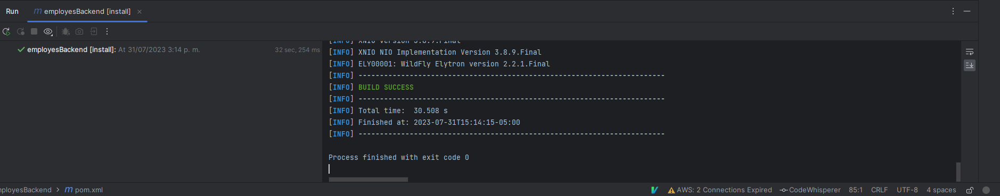
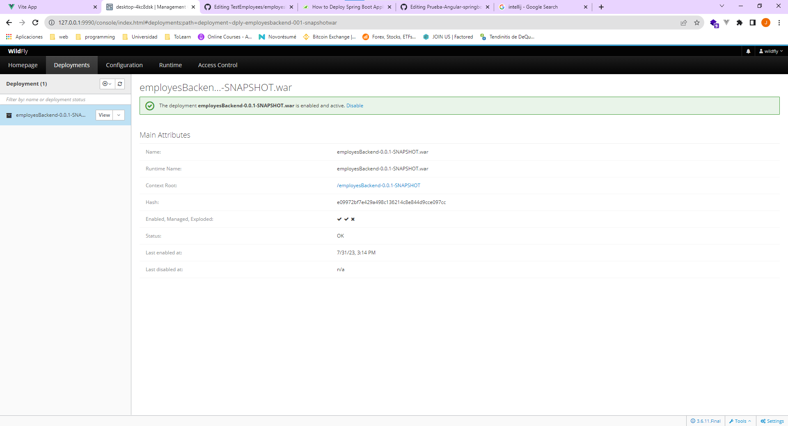
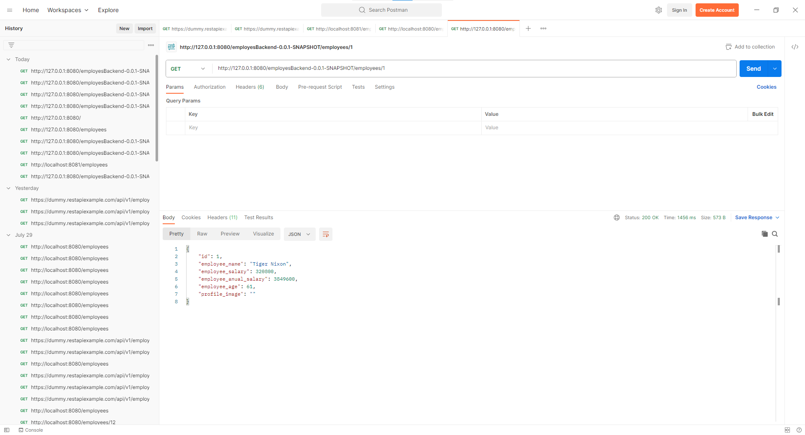

# Backend project for Employees' API

Brief description of the project.

## Setup and Installation

Instructions on how to get the project set up locally.

1. Clone the project
2. Now download WildFly application server https://www.wildfly.org/ 
3. Next step is setting up WildFly user
4. with a terminal move into bin subdirectory
5. run ./add-user.sh on Linux or add-user.bat on Windows
6. 
7. Now we can run WildFly server using ./standalone.sh (Linux) or .\standalone.bat (Windows
8. Now enter http://127.0.0.1:9990 into the browser, after entering admin credentials (defined in the previous step) you should see WildFly admin console
9. 
10. Now You can open the project with IntelliJ IDEA or whatever text editor
11. If you open the project with IntelliJ IDEA we can deploy the project Automatically without Maven need it to be installed on your machine
12. Click on the M on your right in IntelliJ and click clean and then install
13. 
14. 
15. 
16. You can go to  http://127.0.0.1:9990 and look in the deployments tab your project deployed and running
17. 
## Usage

You can test the API in Postman for example

