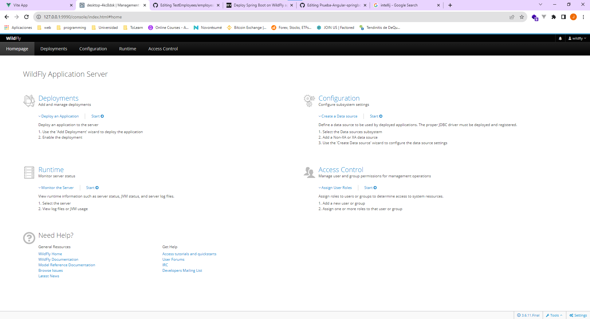

# Backend project for Employees' API

Brief description of the project.

## Setup and Installation

Instructions on how to get the project set up locally.

1. Clone the project
2. Now download WildFly application server https://www.wildfly.org/ 
3. Next step is setting up WildFly user
4. with terminal move into bin sub directory
5. run ./add-user.sh on Linux or add-user.bat on Windows
6. 
7. Now we can run WildFly server using ./standalone.sh (Linux) or .\standalone.bat (Windows
8. Now enter http://127.0.0.1:9990 into the browser, after entering admin credentials (defined in the previous step) you should see WildFly admin console
9. 
10. You can open the project with Intellij IDEA or whatever text editor
11. If you open the project 
## Usage

A simple example of how to use the project.

## Contributing

If you are open to contributions, provide guidelines on how others can contribute to your project.

## Other Information

Any other relevant information or links.
